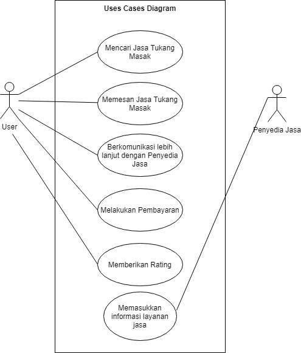
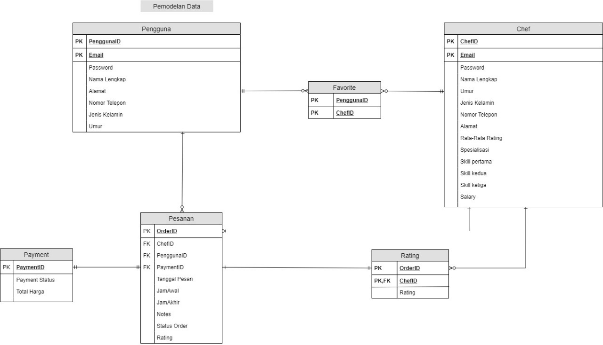

# Foodmates

Nama Anggota Kelompok :
1. M. Naufal Abdillah (G64180016)
2. Berly Setiawan (G64180044)
3. Faiz Muhammad ‘Alauddin (G64180084)

## Latar Belakang 
  Di jaman sekarang, kebutuhan akan tukang masak (Chef) sangatlah besar. Hal ini dikarenakan banyaknya acara yang diselenggarakan oleh masyarakat namun informasi mengenai hal tersebut sangatlah terbatas. Pada umumnya masyarakat akan mencari dengan cara menanyakan informasi jasa Chef ke orang orang terdekat saja, namun hal ini akan menjadi masalah ketika mereka tidak memiliki kenalan Chef. Jika mereka bertemu dengan orang baru maka akan muncul kemungkinan mereka mendapatkan harga yang mahal.
  Contoh permasalahan ini adalah kebutuhan akan koki profesional maupun rumahan untuk dipekerjakan secara permanen maupun sementara, seperti saat acara wedding, sunatan, acara arisan, hingga acara seminar seminar yang dibuat oleh mahasiswa.

## Tujuan
  Menyediakan layanan untuk jasa Chef / Koki rumahan maupun profesional sesuai kebutuhan yang dapat dipesan lewat aplikasi dengan harga serta kemampuan Penyedia Jasa yang transparan.

## Ruang Lingkup
Ruang lingkupnya adalah aplikasi memesan jasa Chef/Koki rumahan maupun profesional

## Deskripsi Perangkat Lunak
Aplikasi ini dapat digunakan untuk memesan jasa Chef rumahan dan profesional. Pengguna dan Penyedia Jasa harus mempunyai akun. Pengguna dapat melihat Spesialisasi para Chef yang menawarkan jasanya, serta melihat detail kemampuan dari seorang Chef yang ingin dipilih. Setelah itu pengguna dapat menghubungi penyedia jasa lebih lanjut untuk melakukan negosiasi dan melakukan pemesanan. 
  Setelah pengguna selesai bernegosiasi dengan penyedia jasa, maka selanjutnya ia melakukan pembayaran. Setelah pembayaran dilakukan maka penyedia jasa akan mengerjakan pesanan dari pengguna dan mengantarnya ke alamat pengguna sesuai waktu yang diminta. Dengan ini kita dapat mempersingkat waktu dalam mencari jasa pemesanan atau catering dan mendapatkan harga yang transparan.

## Analisis User (User Profile)
User dari aplikasi ini adalah masyarakat

## User Story
* User dapat melihat deskripsi dari chef
* User dapat memberikan rating pada chef yang sudah dipesan
* User ataupun Chef dapat mengganti data profilnya
* Chef dapat memilih menerima atau menolak pesanan yang masuk dari user

## Use Case Diagram

## Use Case Description

## Activity Diagram

## Gantt Chart

## ERD

## Hasil Implementasi Perangkat Lunak
